# Webpack@5 调研报告

::: tip webpack: 针对于 JavaScript 应用程序的"打包工具"和"构建工具"

[[toc]]

[webpack 中文文档](https://webpack.docschina.org/concepts/)
:::

## 第一分部：使用整体思维模式认识 Webpack

**1.当前认知中的 webpack 是什么样的？**

webpack 一款针对于 JavaScript 应用程序的静态文件打包工具。简而言之，webpack 能将不同类型的文件模块`例如，.js | .css | .png等的`，按照我们自定义的 webpack 规则`webpack.config.js`，输出一个或多个 bundle 包文件并重组、拼接形成一个更符合我们需求的 JavaScript 应用程序。

**2.如何自定义 webpack 配置规则？webpack.config.js 怎么写？**

webpack.config.js 是 webpack 默认的配置文件名称。还有，我们要知道 webpack 解析代码包和 webpack-cli 指令包是两个不同的项目。所以，当我们的 webpack 在执行构建任务时，会做以下两件事件：

- 第一件事：webpack-cli 脚手架先解析该文件里面的内容，得到配置信息。
- 第二件事：调用 webpack 包，按照配置内容，完成构建任务。

本质上，{ “build”: "webpack" } => { "build": "webpack-cli --config webpack.config.js" }

上述内容，帮助我们了解 webpack.config.js 配置文件，我们来看一下 webpack 的核心概念。

- `1.entry 指定打包入口 && 默认值：./src/index.js`
- `2.output 指定打包出口 && 默认值：./dist/main.js` 用来告诉 webpack 将编译后的文件输出到磁盘中的什么位置。
- `3.mode设置内置模式 && 默认值: production 生产模式`用于指定 webpack 运行环境。
- `4.Loader文件类型扩展` webpack 开箱即用只支持.js 和.json 两种文件类型，若想支持其他类型的文件，则需要使用不同的 Loader，将源文件转化成 webpack 有效模块。
- `5.Plugins功能扩展`

```js
// wbepack.config.js

const path = require("path");
const HtmlWebpackPlugin = require("html-webpack-plugin");

module.exports = {
  mode: "production", // production 生产模式 || devlopment 开发模式 || none，不使用任何默认的优化选项
  entry: "./src/index.js",
  output: {
    filename: "[name].bundle.js", // filename, 指定出口文件的名称
    path: path.resolve(__dirname, "./dist"), // path, 指定出口文件的路径
    clean: true, // clean, 配置webpack如何清空出口目录

    // assetModuleFilename 自定义输出文件名
    // [hash] 占位符，根据文件内容进行hash加密
    // [ext] 占位符，表示文件后缀名，例如".svg | .png"
    assetModuleFilename: "assets/[hash][ext]",
  },
  module: {
    // rules，自定义webpack模块扩展规则，接收一个对象数组
    rules: [
      {
        test: /\.js$/, // test，指定匹配规则
        exclude: /node_modules/, // exclude，指定忽略文件
        use: "babel-loader", // use，指定使用的loader名称和loader options配置规则
      },
      {
        test: /\.(png|jpg)/,
        type: "asset/resource", // "asset/resource" 打包生成资源文件，并在引用的时候，导出RUL地址
      },
    ],
  },
  plugins: [
    new HtmlWebpackPlugin({
      template: "./index.html",
    }),
  ],
};
```

## 第二分部：使用专精思维模式练习 Webpack



### 1. webpack 是如何解决"multiple chunks"导致输出文件名冲突的问题？

::: details Conflict: Multiple chunks emit assets to the same filename main.js

- **需求：**

  1. 假设 entry 现在有两个出口"app"、"search"，如何根据不同的 chunks 输出对应的文件内容呢？
  2. 要求输出两个文件："./dist/app.js" 和 "./dist/search.js"

- **解决方案：**

  - webpack 引用了[name]占位符的概念，用来确保文件名的唯一

- **webpack.config.js 代码如下：**

```js
const path = require("path");

module.exports = {
  mode: "production",
  entry: {
    app: "./src/index.js",
    search: "./src/search.js",
  },
  output: {
    path: path.join(__dirname, "./dist"),
    filename: "[name].js",
  },
};
```

:::

### 2. 以图片资源为例，看看 webpack@5 是如何处理资源模块的？

::: details 测试用例：在 webpack 项目中引入一张名为 logo.png 的图片？
webpack@5 新增了资源模块(asset module)，它是一种模块类型，它允许使用资源文件（字体，图标等）而无需配置额外 loader。

- **webpack.config.js 文件代码**

```js
const path = require("path");
const HtmlWebpackPlugin = require("html-webpack-plugin");

module.exports = {
  mode: "production",
  entry: "./src/index.js",
  output: {
    filename: "[name].bundle.js",
    path: path.resolve(__dirname, "./dist"),
    // assetModuleFilename 自定义输出文件名
    // [hash] 占位符，根据文件内容进行hash加密
    // [ext] 占位符，表示文件后缀名，例如".svg | .png"
    assetModuleFilename: "assets/[hash][ext]",
  },
  module: {
    rules: [
      {
        test: /\.js$/,
        exclude: /node_modules/,
        use: "babel-loader",
      },
      {
        test: /\.(png|jpg)/,
        type: "asset/resource", // "asset/resource" 打包生成资源文件，并在引用的时候，导出RUL地址
      },
    ],
  },
  plugins: [
    new HtmlWebpackPlugin({
      template: "./index.html",
    }),
  ],
};
```

- **src/index.js 文件代码**

```js
import React from "react";
import ReactDOM from "react-dom";
import logoImage from "./assets/img/logo.png";

console.log(logoImage); // http://127.0.0.1:5502/dist/assets/f3150a6bbdf13d9e0ff1.png

class App extends React.Component {
  render() {
    return (
      <div>
        
      </div>
    );
  }
}
ReactDOM.render(<App />, document.getElementById("root"));
```

:::

### 3. webpack 文件监听原理 watch && watchOptions

::: details 原理分析：webpack --watch 做了哪些事情？

- **需求分析：**

当我们在开发环境中编码时，要是每次细小的变动，都得重新构建项目的话？那未免也太麻烦了吧。

- **解决方案：**

基于上述问题，webpack 引入了 watch 的概念，通过一个轮询机制`watchOptions.poll`不断地收集发生变化的文件，并将其缓存起来，然后延迟一段时间`watchOptions.aggregateTimeout`后，重新构建一次，并释放已经累积的缓存文件。

若是某些系统，监听大量文件会导致大量的 CPU 或内存占用。我们可以使用`watchOptions.ignored`忽略不必要的文件。

```js
// webpack.config.js

module.exports = {
  watch: true, // 相当于指令 webpack --watch
  watchOptions: {
    ignored: /node_modules/,
    // 1000ms && 默认 1s 轮询一次(不停地询问系统指定文件有没有发生变化)
    // 判断文件发生变化的条件是：文件最后编辑时间是否发生变化
    poll: 1000,
    aggregateTimeout: 300, // 每隔300ms，重新构建一次
  },
};
```

- **缺点**

缺点 1：每次重新构建之后。依旧需要我们手动去刷新浏览器，才能看到页面效果。

缺点 2：每次重新构建之后，都会进行一次磁盘读写，而不是存到内存里面。

正因如此，才促使了热更新替换技术的诞生。

:::

### 4. webpack 提供的文件指纹策略 Hash && ChunkHash && Contenthash

::: details Hash && ChunkHash && Contenthash 的适用场景？怎么样才能有效利用浏览器缓存机制。

**需求分析：**

什么是文件指纹？即“打包后输出文件的后缀名”。`例如，<script src="app703a459f67efec54a745.js"></script>里面的703a459f67efec54a745`

文件指纹有什么用呢？当我们的项目在进行迭代更新的时候，若是某个文件里面的内容发生了变化，但是，重新上线的文件名称却没有变化的话？浏览器是不会使用更新文件的，而是继续使用缓存文件。

针对与浏览器的这种缓存机制？我可以“Ctrl + F5 强制刷新” 或者 “每次重新打包项目时，更改哪些文件内容发生过改变的文件名称，让浏览器主动加载那些变动文件。”

很显然！每次让用户强制刷新是不现实的。只能每次打包构建的时候，更改文件名称了。

**webpack 解决方案：**

针对与浏览器缓存的问题？webpack 给我们提供了以下三种文件指纹：

1.Hash：和整个项目的构建有关系，只要项目文件有修改，整个项目构建生成的 hash 值就会更改。

2.Chunkhash: 和 webpack 打包的 chunk 有关，不同的 entry 会生成不同的 chunkhash 值。

3.Contenthash: 根据文件内容来定义 hash，文件内容不变，则 contenthash 不变。

**文件指纹的使用场景：**

- 场景 1：针对于.js 文件时，使用 chunkhash

```js
module.exports = {
  mode: "production",
  entry: "./src/index.js",
  output: {
    path: path.resolve(__dirname, "./dist"),
    filename: "[name][chunkhash].js",
  },
};
```

- 场景 2：针对于图片文件时，使用 hash

```js
module.exports = {
  output: {
    assetModuleFilename: "assets/[hash][ext]",
  },
  module: {
    rules: [
      {
        test: /\.(png|jpg)$/,
        type: "asset/resource",
      },
    ],
  },
};
```

:::

### 5.热更新替换解决了哪些问题？其原理又是怎么样的？

::: details 以 webpack-dev-cli 为例，阐明热更新替换的实现原理？
**1.热更新替换解决了哪些问题？**

- 1.每次会将热更新的文件存到内存中，而不是像 watch 一样读写磁盘。
- 2.只替换发生变化的 bundle.js 包文件，并提供 Live Reloading 服务。

**2.webpack Dev Server 的原理分析:**


- Webpack Compiler：将 JS 编译成 Bundle 包
- Bundle Server: 提供文件给浏览器访问
- bundle.js: 构建输出的文件
- HMR Server: 将热更新的文件输出给 HMR Runtime
- HMR Runtime: 会被注入到浏览器中，更新文件的变化
  :::

### 6.注意！在使用 PostCSS、Babel 的时候，记得添加 browserslist 属性。

::: details browserslist 设置浏览器的兼容范围
若是不加 browserslist 属性，会怎么样呢？ —— 最好的情况就是有默认值；最坏的情况就是插件无效。

```json
// package.json

{
  "browserslist": [
    "last 2 versions", // 兼容浏览器最近的两个版本
    ">1%", // 只兼容全球用户大于1%的浏览器
    "IOS 7" // 兼容IOS浏览器
  ]
}
```

:::

<!-- ### 1. webpack.config.js 配置文件的设计需求与原理？
> 需求：如何优雅地在不同环境中运行项目?
>
> 原理图如下：

 -->

<!-- ```md

# 5. Plugins 配置
    - 5-1. HtmlWebpackPlugin 生成HTML5文件，并body中使用 script 标签引入你所有 webpack 生成的 bundle。
``` -->

<!-- ## 附录B: webpack 构建web应用流程图

```md
构建任务：
1. 转换 ES6 语法
2. 转换 JSX
3. CSS 前缀补全/预处理器
4. 压缩混淆
5. 图片压缩

``` -->
